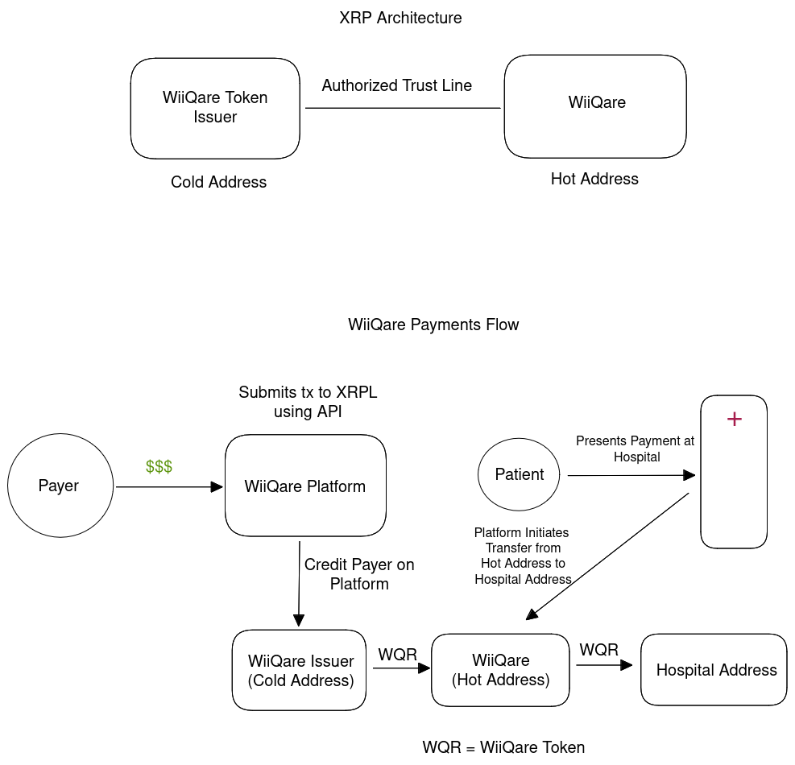

# WiiQare-XRPL
This repository holds a proof-of-concept for the XRPL token issuance architecture. Internally, we use a token (WQT) pegged to USD/EUR that we use for the internal accounting of remittance funds, as well as on-chain transparency of funds for our users. Note that this token only has value within WiiQare's network, although this could change in the future. This token allows us to credit users with funds and have funds immediately available for presentation at partnered healthcare facilities. 

## Design Overview
WiiQare is a remittance platform for healthcare in Africa. WiiQare aims to reduce remittance fees and increase speed of transfer by using crypto as an intermediary. Our platform consists of a user interface for migrants, beneficiaries, and member hospitals allowing for seamless healthcare remittances. In terms of the on-chain part of our solution, we are considering multiple approaches. Currently, we have decided on a fungible token approach. 
The payments flow currently looks like the following:

The payment flow goes as follows:
1. Payer sends funds to WiiQare, the Payer's WiiQare account is credited with funds
2. Once funds are received, WQR tokens are issued by the WiiQare Issuer cold wallet
3. Tokens are transferred to WiiQare hot wallet so that they are ready for distribution.
4. On the WiiQare platform, the Payer transfers funds to Beneficiary's WiiQare account.
5. Beneficiary/Patient presents their payment to hospital.
6. The WiiQare platform initiates an on-chain transfer of WQR to the hospital's associated address.
7. Once the hospital redeems their tokens, the tokens are burned.

Note that the hospital address is managed by WiiQare. 

## Code Walkthrough

As stated earlier, this is a simple proof-of-concept for the issuance architecture. We first initialize and XRPL account and fund it, this is the cold_wallet. This account will issue WQR. Similarly, we initialize our hot wallet (hot_wallet) and fund it, enabling authorized trust lines on this account in order to restrict the token to WiiQare's internal network. Then, the issuer account (cold_wallet) sends WQR to the WiiQare hot wallet. 

